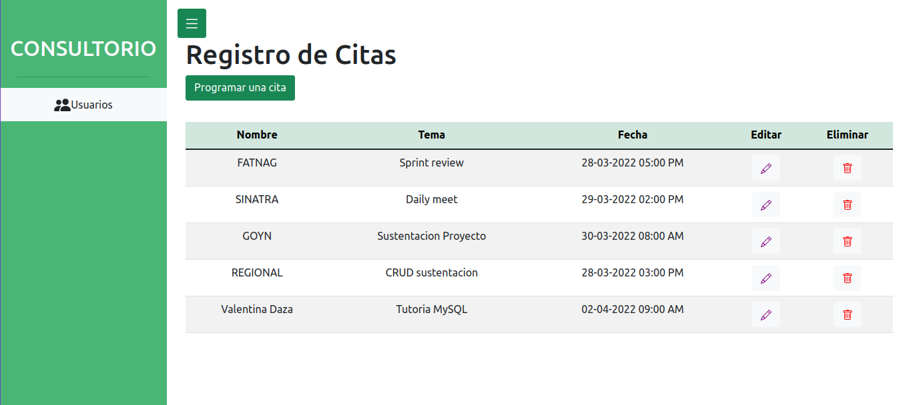
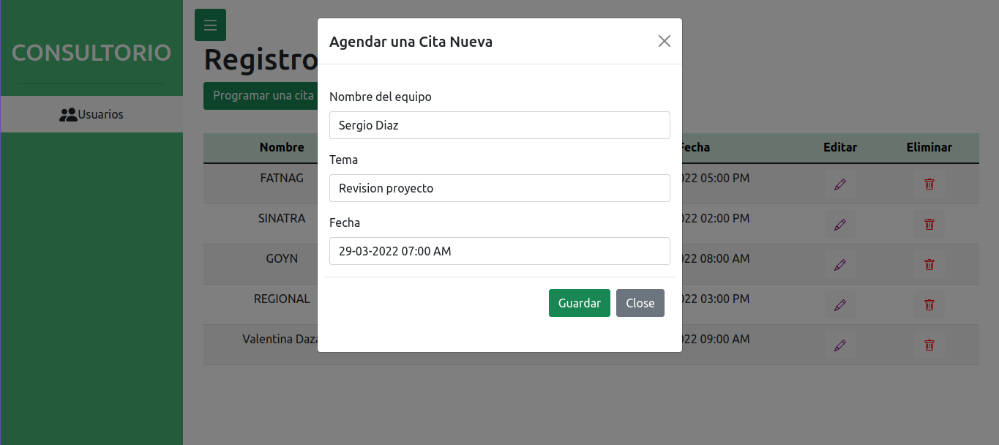
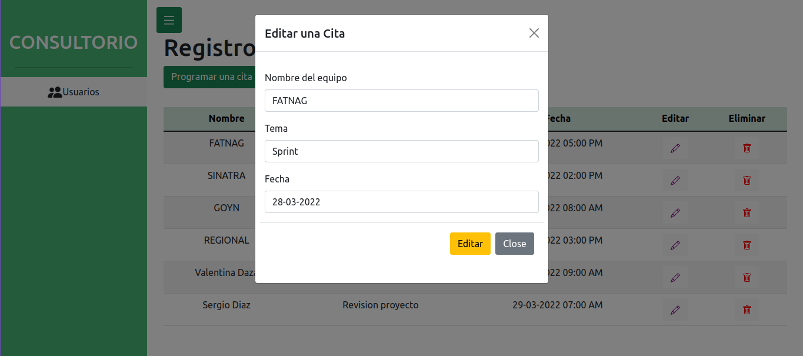
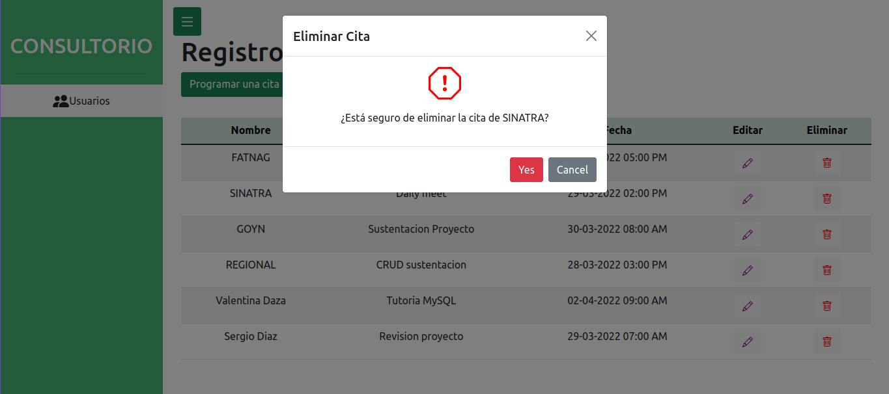

<h1>📅CRUDo CONSULTORIO📅</h1>

Office application that allows developers and teams to make an appointment to solve technical problems with the help of the trainer or CTO. CRUD made with php and mysql. 

Home

Add date

Edit date

Delete date

<h1>Construido con 🔧</h1>

<ul>
    <li>PHP</li>
    <li>mySQL</li>
</ul>

<h1>Autores ✒️</h1>

<ul>
    <li>Emmanuel Estupiñan Quintero</li>
    <li>María José Alba</li>
</ul>
